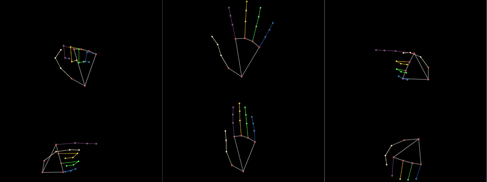
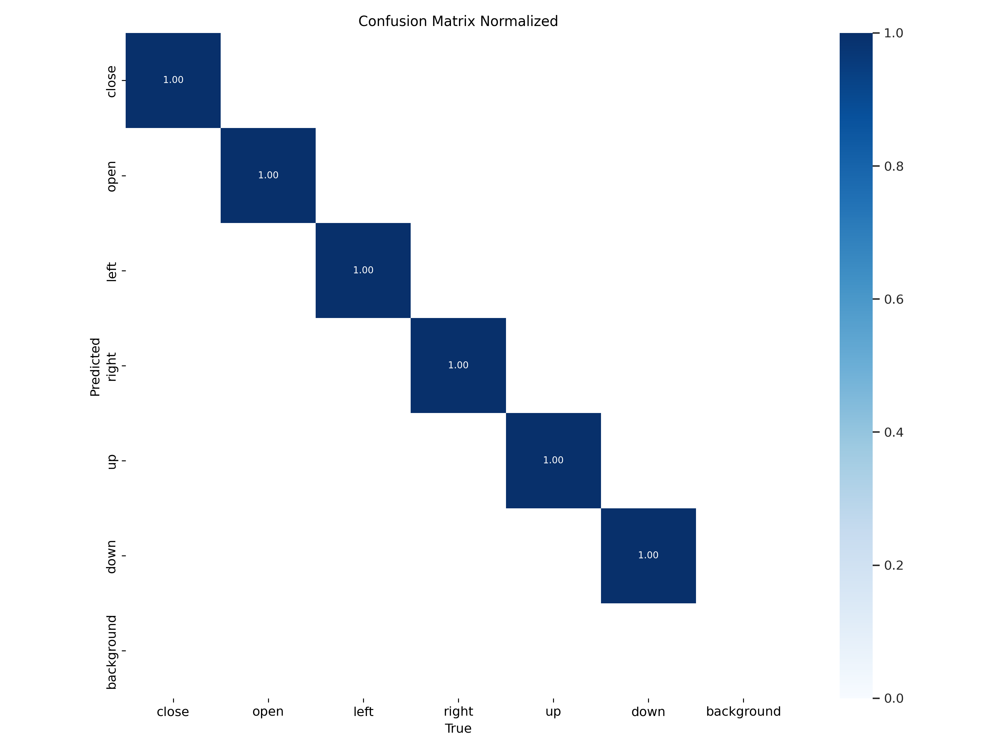
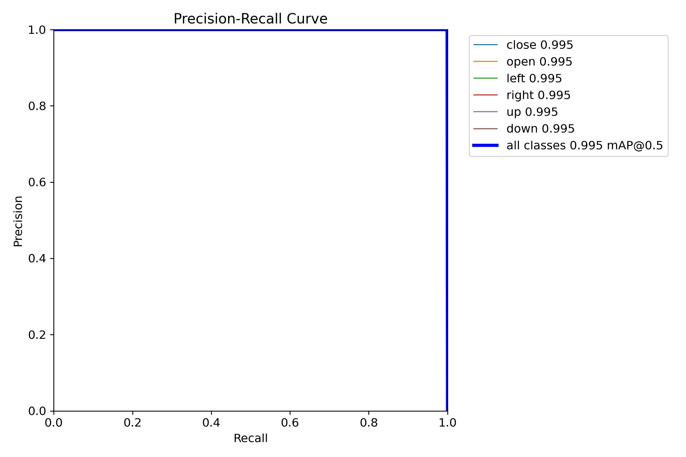
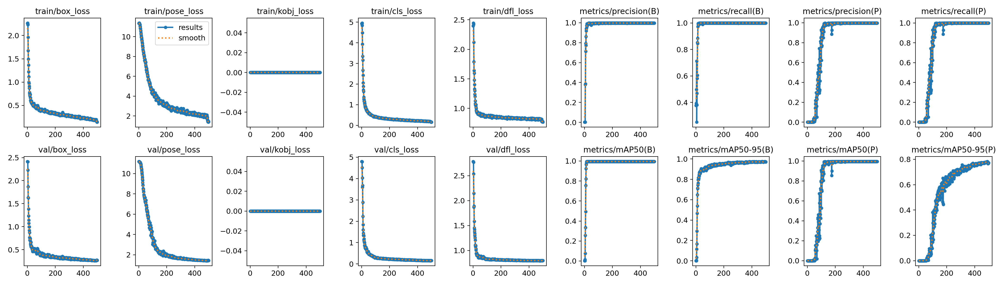

# OpenCV + Ultralytics hand gesture system control

In this project, we combine opencv and ultralytics to develop an application focusing on hand gestures and system control.


## OpenCV: Open Camera

Firstly, we set up a webcam controller to control the camera frame.

```python
class StreamController(object):

    def __init__(self, h, w, src=0):
        # Initialize video stream
        self.stream = cv2.VideoCapture(src)
        self.stream.set(cv2.CAP_PROP_FRAME_WIDTH, w)
        self.stream.set(cv2.CAP_PROP_FRAME_HEIGHT, h)

        # Read the first frame
        self.success, self.frame = self.stream.read()
        self.stopped = False

    def start(self):
        # Start the thread for capturing frames
        Thread(target=self.get, args=()).start()
        return self
    
    def get(self):
        # Continuously capture frames from the video stream
        while not self.stopped:
            if not self.success:
                self.stop()
            else:
                self.success, self.frame = self.stream.read()

    def stop(self):
        # Stop the thread and release the video stream
        self.stopped = True
```

In the controller, we employ multi-thread processing to enhance the frame rate (fps) increment. In our particular scenario, we have the subsequent comparison:

- no Thread: 30 fps
- Multi-Thread: 50 fps

## What action would we like to implement?

In this simple example, we demonstrate six distinct hand-controlled actions. These actions include: 

- Open vscode
- Close vscode 
- Open calculator
- Open wordpad
- Open control panel

The commands on the terminal corresponding to this are as follows:

```cmd
taskkill /f /im code.exe
code .
Calc
notepad
write 
control
```

we can simply call `os.system("your command here")` to send a command to the terminal.

```python
class ActionSpace(object):

    # Dictionary to map action indices to corresponding functions
    action_mapping = {
        0: lambda: os.system("taskkill /f /im code.exe"), # close vscode 
        1: lambda: os.system("code ."), # open vscode 
        2: lambda: os.system("Calc"), # open calculator
        3: lambda: os.system("notepad"), # open txt note
        4: lambda: os.system("write"), # open wordpad
        5: lambda: os.system("control"), # open control panel
    }
```

## Which gesture should we use?

There are many gestures that can be used to distinguish different actions, but the question is, how do you recognize these gestures? For example, 
the gesture of palm up can be detected by the landmarks of the hand keypoints, and calculate the vertical difference between the keypoints of each finger, similar can detect palm down; however, it can not detect more complex gesture, therefore, in the example, we will first collect data and then use ultralytics to train YOLOv8 models for detection.


In this project, we use the following gestures:

- 0: close
- 1: open
- 2: point to left
- 3: point to right
- 4: palm up
- 5: palm down



## Collect data

One way to collect data is to use Mediapipe bulid-in model to output the landmarks and bounding boxes of hands; for example, in our example, we have six actions to implement, we can do six different gestures and save the images and labels. I have written a file to implement it (`data_collectoin.py`).

```python
# extract (x, y) coordinate
landmarks += [lm.x for lm in handLms.landmark] + [lm.y for lm in handLms.landmark]
xs = landmarks[0::2]
ys = landmarks[1::2]

# calcu top left corner (xmin, ymin) and bot right corner (xmax, ymax)
xmin, ymin = min(xs), min(ys)
xmax, ymax = max(xs), max(ys)

# calc yolo format [x (center), y (center), w, h]
xc, yc = (xmin + xmax) / 2, (ymin + ymax) / 2
w, h =  (xmax - xmin), (ymax - ymin)

# write annotation txt file with lines "cls xc yc w h lms..."
landmarks = [str(k) for k in landmarks]
root = os.path.join(self.save_path, "train") if nd % 2 else os.path.join(self.save_path, "val")
with open(os.path.join(root, "labels", f"{self.cls_idx}_{nd}.txt"), 'w') as f:
    lines = f"{self.cls_idx} " + " ".join([str(xc), str(yc), str(w), str(h)]) + " " + " ".join(landmarks)
    f.write(lines)
    plt.imsave(os.path.join(root, "images", f"{self.cls_idx}_{nd}.jpg"), frameRGB)
    nd += 1
```

For training a YOLOv8 model, we have to offer the hand keypoints and the bounding boxes in YOLO format, for the bounding boxes, we just simply use the boundary of the keypoints, the overall process is listed as follows:

1. Do a gesture on the screen
2. Use Mediapipe to record images and labels (gestation, bounding boxes, keypoints).
3. Write in YOLO format

## Train YOLOv8

To use ultralytics training for the YOLOv8 model, we first have to install ultralytics

```
conda create -n ultralytics 
conda activate ultralytics
pip install ultralytics
```

### Custom dataset

For training the custom dataset, your dataset folder structure should be like the following.

```
yolo_dataset/
|-- train/
| |-- images/
| | |-- image_001.jpg
| | |-- image_002.jpg
| | |-- ...
| |
| |-- labels/
| |-- image_001.txt
| |-- image_002.txt
| |-- ...
|
|-- val/
| |-- images/
| | |-- image_101.jpg
| | |-- image_102.jpg
| | |-- ...
| |
| |-- labels/
| |-- image_101.txt
| |-- image_102.txt
| |-- ...
|
|-- test/
| |-- images/
| | |-- image_201.jpg
| | |-- image_202.jpg
| | |-- ...
| |
| |-- labels/
| |-- image_201.txt
| |-- image_202.txt
| |-- ...
```

- **train/:** Folder containing training data.
  - **images/:** Folder containing training images.
    - `image_001.jpg`
    - `image_002.jpg`
    - ...
  - **labels/:** Folder containing YOLO format label files for training images.
    - `image_001.txt`
    - `image_002.txt`
    - ...

- **val/:** Folder containing validation data (similar structure to the training data).
  - ...

Furthermore, you have to write the YAML file, 

- One thing to mention is the `kpt_shape`, should be [num_keypoints, dim]
   - dim can be 2 or 3
      - 2: (x, y) coordinate
      - 3: (x, y, v) coordinate, the value of visible can be the following
         - 0: keypoint not present
         - 1: keypoint not visible
         - 2: keypoint visible

```yaml
path: yolo_dataset # dataset root dir
train: train  # train images (relative to 'path')
val: val  # val images (relative to 'path')
test:  test # test images (optional)

# Keypoints
kpt_shape: [21, 2]  # number of keypoints, number of dims (2 for x,y or 3 for x,y,visible)

# Classes
names:
  0: close
  1: open
  2: left
  3: right
  4: up
  5: down
```

### Training phase

After preparing out the dataset, we just simple call the following command to train the model.

```python
yolo detect train data=your_yaml_file.yaml model=yolov8n.pt epochs=100 imgsz=640
```

Or write a python script with 

```python
from ultralytics import YOLO

# load a pretrained model (recommended for training)
model = YOLO('yolov8n-pose.pt')

# Train the model
results = model.train(data='coco8-pose.yaml', epochs=1000, imgsz=640, device=[0,1,2,3,4,5,6,7], batch=128)
```

You may view other training configuration on the offical website [https://docs.ultralytics.com/modes/train/](https://docs.ultralytics.com/modes/train/)

### Evaluating model

After training, we may called the following command to evaluate model performance

```
yolo detect val model=path/to/best.pt  # val custom model
```

In my own dataset, we have the following metrics

#### Confusion matrix



#### Bounding boxes PR curve 



#### Pose PR curve


#### Overall



Umm 🤔, it since like we overfit the model. Nevermind, we just train for fun.

## Recognize gestures in real-time stream

In the prediction phase, we just need to run 

```python
results = model(frame)
annotated_frame = results[0].plot()
```

It is simple to predict the output of each frame; however, the question is how to implement the action after doing a gesture?

My solution is to maintain the same gesture for a specified time, then the system will implement the corresponding action. This can be achieved through the following code:

```python
if cls_idx == pcls:
    # Accumulate time if the same class is detected
    aTime += time.time() - pTime
    end_angle = int(aTime / self.action_time * 360)
    cv2.ellipse(frame, (int(xyxy[0]) + 20, int(xyxy[1]) - 70), (20,20), 0, 0, end_angle, (0,255,0), thickness=3)
    cv2.putText(frame, f"loading...", (int(xyxy[0]) + 50, int(xyxy[1]) - 50), cv2.FONT_HERSHEY_SIMPLEX, 1, (0,255,0), 3)
    if aTime > self.action_time:
        # Execute the action if the time threshold is reached
        self.action[cls_idx]()
        aTime = 0
else:
    aTime = 0
pcls = cls_idx
```

The overall code can be viewed in script `main.py`